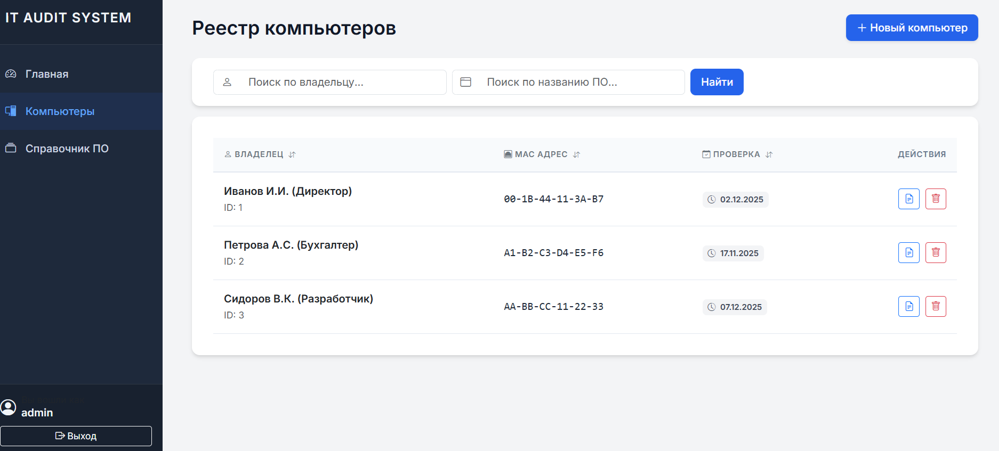
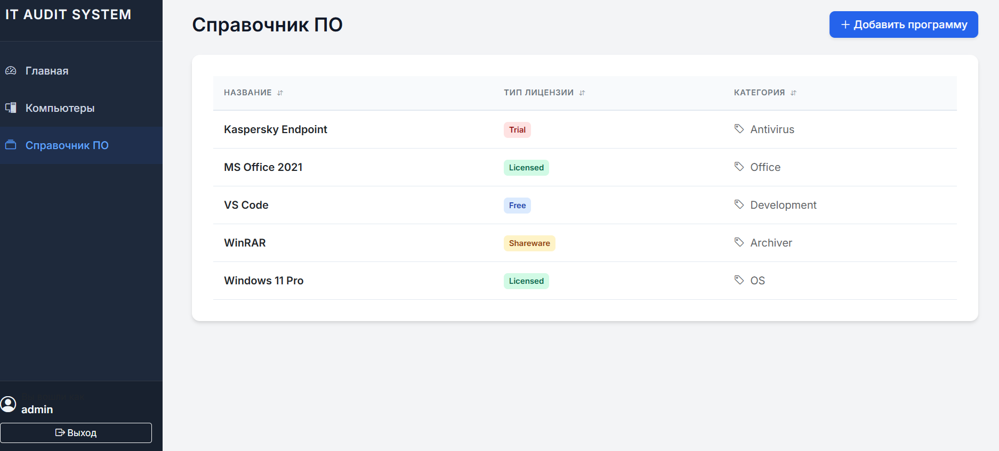
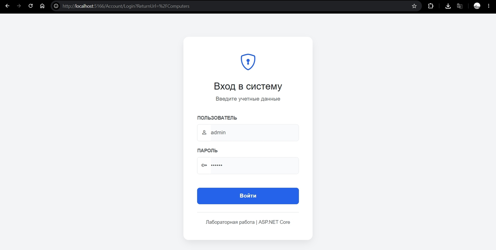

# 🖥️ IT Audit System

## Система учёта компьютеров и программного обеспечения предприятия

ASP.NET Core MVC • Entity Framework Core • SQLite • ASP.NET Identity

---

## 📖 О проекте

**IT Audit System** — информационная система для автоматизации учёта компьютерной техники и установленного программного обеспечения организации.

Система позволяет:

- вести реестр компьютеров;
- учитывать установленное программное обеспечение;
- контролировать типы лицензий;
- хранить сведения о владельцах рабочих станций;
- формировать технический паспорт компьютера;
- управлять справочником программного обеспечения;
- разграничивать права пользователей.

Проект разработан на ASP.NET Core MVC с использованием Entity Framework Core и SQLite.

---

## ✨ Возможности

### 🔐 Авторизация и роли

Поддерживаются роли:

- **Administrator**
  - управление компьютерами;
  - управление программным обеспечением;
  - удаление записей;
  - изменение конфигурации;

- **User**
  - просмотр информации;
  - просмотр технических паспортов.

### 🖥️ Реестр компьютеров

Для каждого компьютера хранятся:

- владелец;
- MAC-адрес;
- дата последней проверки;
- список установленного ПО.



---

### 📦 Справочник программного обеспечения

Единый каталог программ содержит:

- название программы;
- тип лицензии;
- категорию ПО.

Поддерживаемые лицензии:

- Licensed
- Free
- Shareware
- Trial



---

### 🔑 Авторизация

Современный интерфейс входа в систему.



---

## 🏗 Архитектура

Проект реализован по паттерну MVC:

Presentation Layer
- Controllers
- Views

Business Layer
- Models
- Services

Data Layer
- Entity Framework Core
- SQLite

---

## 🚀 Быстрый запуск

```bash
git clone https://github.com/USERNAME/IT-Audit-System.git
cd IT-Audit-System

dotnet restore
dotnet ef database update
dotnet run
```

---

## 👤 Тестовые пользователи

```text
Администратор:
admin / admin

Пользователь:
user / user
```

---

## 🛠 Используемые технологии

- ASP.NET Core MVC
- Entity Framework Core
- SQLite
- ASP.NET Identity
- Bootstrap 5
- Razor Views
- LINQ

---

## 📸 Галерея

### Вход в систему


### Реестр компьютеров


### Справочник программ


---

⭐ Если проект оказался полезным — поставьте звезду репозиторию.
